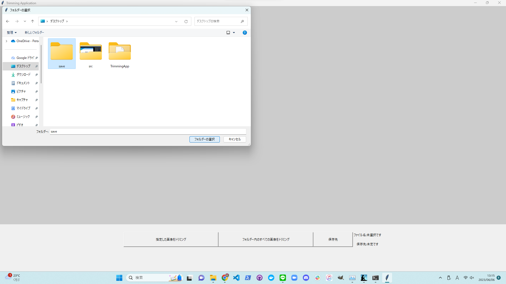
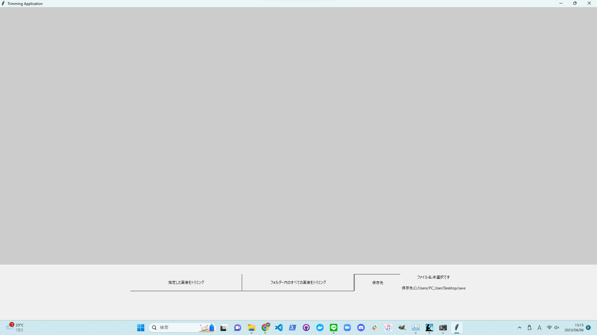
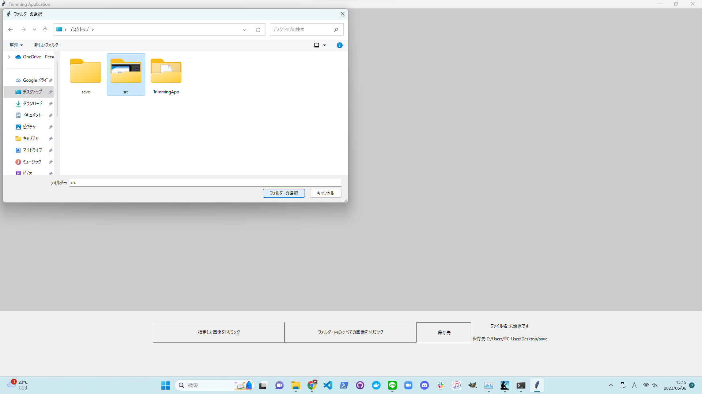
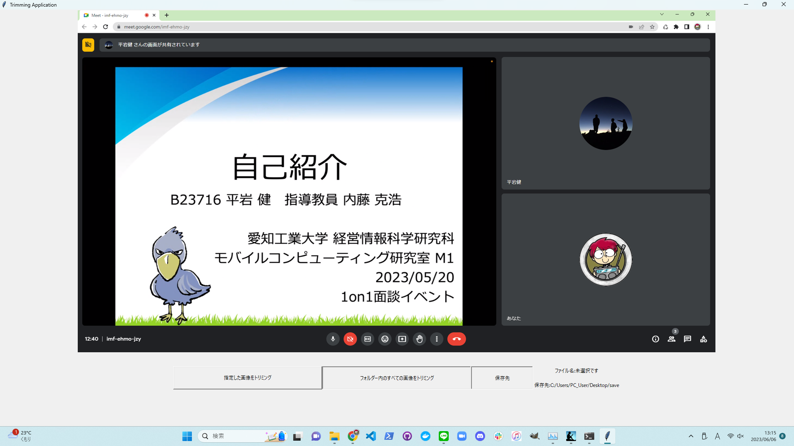
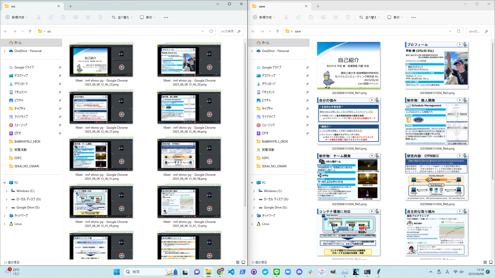

# TrimmingApp

トリミングの要領で一度範囲を選択すると、指定したフォルダー内に保存されている全ての画像にトリミングが適用されるアプリケーションです。

# 使い方

## Topページについて

 

***

## トリミングした画像の保存先の選択

 

 

***

## トリミングを実行する対象のフォルダーを選択

 

 

## トリミングを実行

 

 

## トリミングの実行結果

 